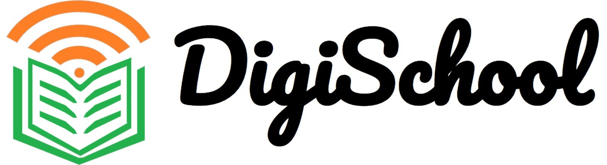

# DigiSchool: Web

This repo is the Source Code of the [DigiSchool Website](https://dipamsen.github.io/DigiSchool-Web/).

  

> *This repo is for the Website for DigiSchool. [Click Here](https://github.com/dipamsen/DigiSchool-App) for the Android App.*

- **Android App: [Github Repo]( https://github.com/dipamsen/DigiSchool-App ) | [APK Link](https://drive.google.com/drive/folders/16F14zIZ6pQgZ-JsOBIgZbXapbkh-F0ey?usp=sharing)**  
- Website: https://dipamsen.github.io/DigiSchool-Web/

---
### What is *DigiSchool*?   
*DigiSchool* is a Digital Platform for School Education. In the current pandemic situation, students can study from home at the time slot of their choice, for each subject in their class. This includes study materials of Global Standard, either in text form or app form. This also has activity based learning through brain games etc.

**Objective of *DigiSchool*:**
- Access to Educational Curriculum of Global Standard - Interactive, Digitalized and Collaborative Learning from Home
- Learn with Fun - Brain Games, Discussion Wall
- Exposure to useful websites in single umbrella - E-Lab, E-Learn, E-Library, E-Dictionary

**Features:**
- Study Resources - worksheets, presentations and more!
- Self-Assessment
- Student Discussion
- Activity - Brain Games
- Repository of Useful External Links

---

